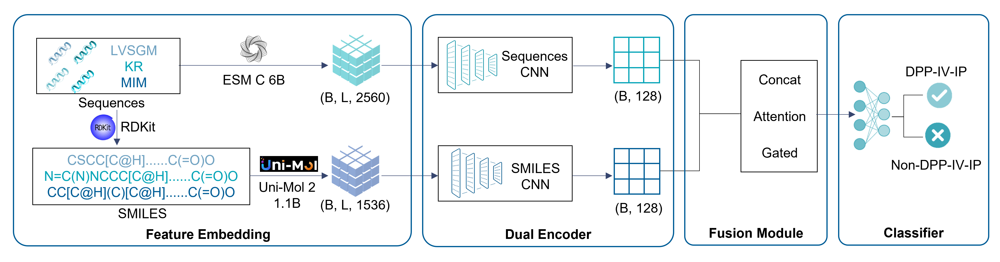

# 🧬 Bilingua-DPP-IV

## 🌐 Quick Start - Web Server

**For immediate use without installation**, we provide a user-friendly web server:

**🔗 [Bilingua-DPP-IV Web Server](https://lmmd.ecust.edu.cn/bilingua/)**

This publicly accessible platform allows experimental researchers to perform rapid in-silico screening of potential DPP-IV inhibitory peptides without any computational modeling background. Simply input your peptide sequences and get instant predictions! 🚀

---

## 📖 Project Introduction

Bilingua-DPP-IV is an advanced machine learning tool that predicts whether peptide sequences exhibit Dipeptidyl Peptidase-IV (DPP-IV) inhibitory activity.

DPP-IV inhibitors show significant potential in treating metabolic diseases such as type 2 diabetes. This tool aims to provide researchers with a rapid and convenient platform for screening potential DPP-IV inhibitory peptides.

We employ a dual-modal fusion deep learning model, integrating sequence information and molecular characteristics for prediction, aiming for high accuracy and reliability. 🎯

## 🏗️ Core Architecture

Peptides, as unique biomolecules positioned between small molecules and proteins, exhibit partial properties of both. Based on this, we innovatively chose to characterize peptides using both amino acid sequences and SMILES (Simplified Molecular Input Line Entry System).

The core of the system is a **dual-modal fusion Convolutional Neural Network (CNN)**. This network can:

- 🔗 Combine protein sequence features (extracted via Protein Large Language Models like [ESM C](https://github.com/evolutionaryscale/esm)) and molecular structure features (extracted via Molecular Large Language Models like [Uni-Mol2](https://github.com/dptech-corp/Uni-Mol)) to predict DPP-IV inhibitory peptides (DPP-IV-IPs).
- ⚡ Utilize **two independent CNN encoders** to efficiently process data from two different modalities.
- 🧠 Effectively integrate information from both encoders through a meticulously designed **fusion module**.
- 🎯 Finally, the integrated features are fed into a **classifier** for the final activity prediction.

Since this system utilizes both protein and molecular large language models for dual representation and learning of peptide sequences, much like using two "languages" to understand peptide characteristics, we named the system "Bilingua". 🗣️

### 📊 System Architecture Diagram



Illustration: Dual-modal fusion model architecture

## 🔮 Future Outlook

We will continuously optimize model performance, expand supported peptide types, and introduce more features, striving to contribute more powerful tools for research in related fields.

## 📦 Installation

### ⚙️ Requirements

- Python 3.8 or higher 🐍
- CUDA 11.0+ (for GPU support) 🖥️
- 16GB+ RAM recommended 💾
- GPU: NVIDIA RTX 4090 (24 GB VRAM) or equivalent recommended for optimal performance 🚀

### 🛠️ Setup

1. Clone the repository:
```bash
git clone https://github.com/Iamzhangzixin/Bilingua-DPP-IV.git
cd Bilingua-DPP-IV
```

2. Create a virtual environment:
```bash
python -m venv venv
source venv/bin/activate  # On Windows: venv\Scripts\activate
```

3. Install dependencies:
```bash
pip install -r requirements.txt
```

**Alternative installation:**
```bash
pip install -e .  # Install in development mode
```

## 🚀 Usage

### 1. 📋 Data Preparation

Place your peptide sequences in CSV format with the following structure:
```csv
seq,label
GFPGAAGFP,1
VPLGTQYTDA,0
```

- `seq`: Peptide sequence (single-letter amino acid codes)
- `label`: 1 for DPP-IV inhibitory peptides, 0 for non-inhibitory

### 2. 🔧 Feature Extraction

#### Step 2.1: Convert sequences to SMILES 🧪
```bash
cd encode/Uni-Mol2
python Seq2SMILES.py
```

This will convert peptide sequences to SMILES format and save them in the `SMILES_output` directory.

#### Step 2.2: Extract ESM-C features 🧬
```bash
cd ../ESMC
python ESMC6B_Encode.py
```

**⚠️ Note**: You need to obtain an API token from [EvolutionaryScale](https://forge.evolutionaryscale.ai/) and replace `YOUR_API_TOKEN_HERE` in the script.

#### Step 2.3: Extract Uni-Mol2 features ⚛️
```bash
cd ../Uni-Mol2
python Uni-Mol-v2_Encode.py
```

### 3. 🎯 Model Training

#### Option A: Train with hyperparameter optimization 🔍
```bash
cd ../../main
python CNN_bimodal_Final.py --mode optuna
```

This will run Optuna hyperparameter optimization to find the best model configuration.

#### Option B: Train with predefined parameters 📈
```bash
python CNN_bimodal_Final.py --mode train
```

### 4. 📊 Model Evaluation

To evaluate the trained model on test data:
```bash
python CNN_bimodal_Final.py --mode evaluate
```

### 5. 🔮 Making Predictions

To predict DPP-IV inhibitory activity for new peptides:

1. Prepare your peptide sequences in a CSV file (e.g., `new_peptides.csv`)
2. Extract features following steps 2.1-2.3
3. Run prediction:
```bash
python CNN_bimodal_Final.py --mode predict --input new_peptides.csv
```

## 🤖 Pre-trained Models

Pre-trained model weights can be downloaded from [link to be added]. Place them in the `model` directory.

## ⚙️ Configuration

Key parameters can be modified in the `CONFIG` dictionary in `main/CNN_bimodal_Final.py`:

- `num_classes`: Number of output classes (default: 2)
- `main_kfold_splits`: Number of folds for cross-validation (default: 10)
- `main_epochs`: Maximum training epochs (default: 100)
- `batch_size_choices`: Batch size options for hyperparameter search

## 📁 Output Files

- `model/`: Trained model checkpoints 💾
- `plot/`: Visualization results including ROC curves, confusion matrices 📈
- `logs/`: Training logs and metrics 📝

## 🛠️ Troubleshooting

### ❗ Common Issues

1. **CUDA out of memory**: Reduce batch size in CONFIG
2. **API token error**: Ensure your ESM-C API token is valid
3. **Missing features**: Check that all feature extraction steps completed successfully

### 💬 Getting Help

For issues or questions, please open an issue on [GitHub](https://github.com/Iamzhangzixin/Bilingua-DPP-IV/issues) or contact the authors.

## 📚 Citation

If you use Bilingua-DPP-IV in your research, please cite this repository:

```bibtex
@misc{zhang2024bilingua,
  title={Bilingua-DPP-IV: A Bimodal Deep Learning Framework for Predicting DPP-IV Inhibitory Peptides},
  author={Zhang, Zhixing and Yu, Qiule and Yang, Chen and Duan, Hao and Fang, Jiajiao and Xu, Jiahao and Gong, Changda and Li, Weihua and Liu, Guixia and Tang, Yun},
  year={2024},
  url={https://github.com/Iamzhangzixin/Bilingua-DPP-IV},
  note={GitHub repository}
}
```

**📝 Note**: A peer-reviewed publication is in preparation. This citation will be updated once the paper is published.

## 📄 License

This project is licensed under the MIT License - see the LICENSE file for details.